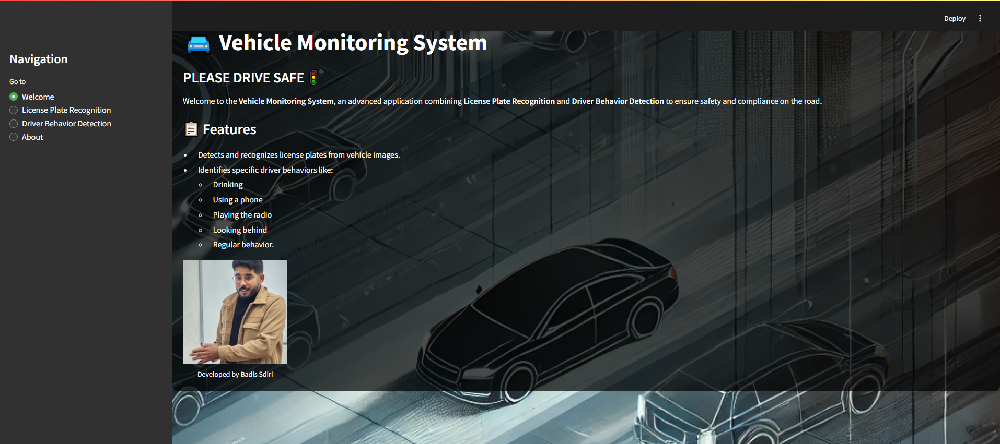

# 🚘 Vehicle Monitoring System



Welcome to the **Vehicle Monitoring System**, an advanced application that combines **License Plate Recognition** and **Driver Behavior Detection** to promote road safety and compliance.

---

## 🚀 Getting Started

### Prerequisites
- **Python**: Version 3.8 or later
- **Virtual Environment**: Recommended for dependency isolation.

---

### Installation

#### Clone the Repository:
```bash
git clone https://github.com/BadisSdiri/vehicle-monitoring-system.git
cd vehicle-monitoring-system
```
####Create and Activate a Virtual Environment:
# For Linux/MacOS
python3 -m venv .venv
source .venv/bin/activate

# For Windows
python -m venv .venv
.venv\Scripts\activate
```bash
pip install -r requirements.txt
```
#### Place Your Trained Models:
Copy the following trained models to the `models/` directory:
- `license_plate_ocr.pth`
- `resnet18_driver_behavior.pth`

---

#### 🔗 Datasets
1. **Driver Behavior Dataset**
   - **Source**: [Kaggle: Distracted Driver Detection](https://www.kaggle.com/datasets/rightway11/state-farm-distracted-driver-detection/data)
   - **Description**: Contains images of drivers engaged in different activities like using a phone, drinking, and others.

2. **License Plate Dataset**
   - **Source**: [Zindi AI Hack Tunisia](https://zindi.africa/competitions/ai-hack-tunisia-2-computer-vision-challenge-2) *(Confidential)*
   - **Description**: Contains images of vehicles and their corresponding license plates for text recognition.

---

#### 🔒 Privacy and Disclaimer

**Privacy**:
- **Local Processing**: Images are processed locally; no data is shared or stored externally.
- **Confidentiality**: The datasets, particularly from Zindi, are handled confidentially as per their terms of use.

**Disclaimer**:
- **Educational Use**: This system is intended for educational and research purposes.
- **Real-World Use**: It is not a substitute for real-world enforcement or monitoring.
- **Safety**: Always drive responsibly and follow road safety guidelines.

---

#### 👨‍💻 Developed By
- **Name**: Badis Sdiri  
- **GitHub**: [https://github.com/BadisSdiri](https://github.com/BadisSdiri)  
- **LinkedIn**: [www.linkedin.com/in/badis-sdiri](https://www.linkedin.com/in/badis-sdiri)

---

🌟 **Show Your Support**  
If you find this project useful, please give it a ⭐ on GitHub!

---

#### 📝 License
This project is licensed under the MIT License. See the LICENSE file for details.

